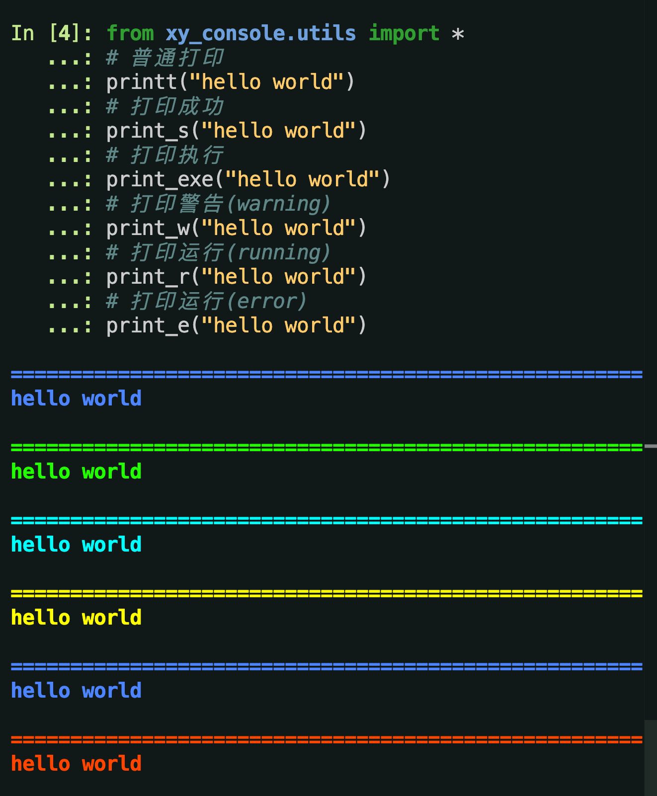

# xy_console

- [简体中文](README.md)
- [繁體中文](readme/README.zh-hant.md)
- [English](readme/README.en.md)

# 说明
简单Python控制台输入输出工具封装.

## 源码仓库

- <a href="https://github.com/xy-base/xy_console.git" target="_blank">Github地址</a>  
- <a href="https://gitee.com/xy-opensource/xy_console.git" target="_blank">Gitee地址</a>  
- <a href="https://gitcode.com/xy-opensource/xy_console.git" target="_blank">GitCode地址</a>  

## 安装

```bash
# bash
pip install xy_console
```

## 开始

```python
from xy_console.utils import *
# 普通打印
printt("hello world")
# 打印成功
print_s("hello world")
# 打印执行
print_exe("hello world")
# 打印警告(warning)
print_w("hello world")
# 打印运行(running)
print_r("hello world")
# 打印运行(error)
print_e("hello world")

```



## 许可证
xy_console 根据 <木兰宽松许可证, 第2版> 获得许可。有关详细信息，请参阅 [LICENSE](LICENSE) 文件。

## 捐赠

如果小伙伴们觉得这些工具还不错的话，能否请咱喝一杯咖啡呢?  


## 联系方式
```
微信: yuyangiit
邮箱: yuyangit.0515@qq.com
```