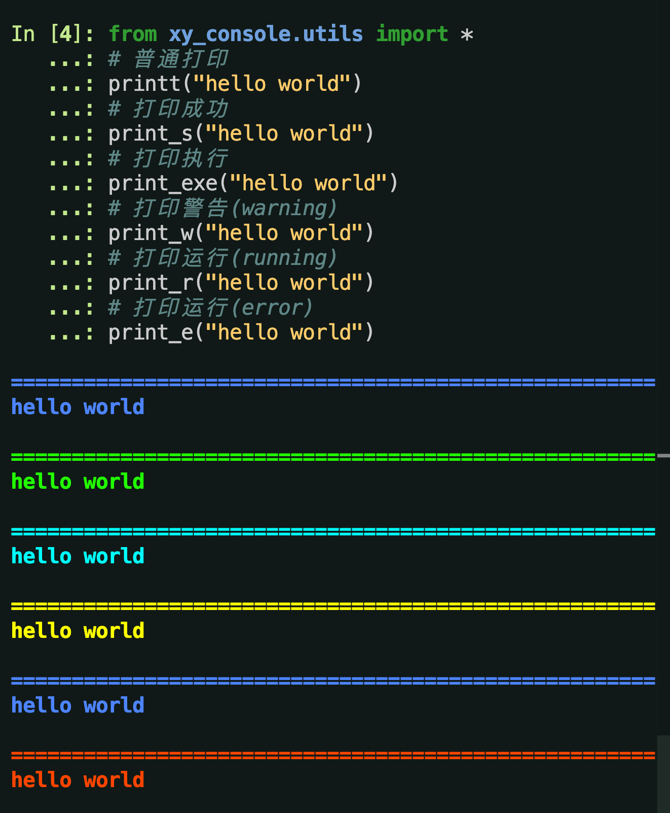

# xy_console

| [简体中文](../README.md)         | [繁體中文](./README.zh-hant.md)        |                      [English](./README.en.md)          |
| ----------- | -------------|---------------------------------------|

# 说明
简单Python控制台输入输出工具封装.

## 程式碼庫

| [Github](https://github.com/xy-base/xy_console.git)         | [Gitee](https://gitee.com/xy-opensource/xy_console.git)        |                      [GitCode](https://gitcode.com/xy-opensource/xy_console.git)          |
| ----------- | -------------|---------------------------------------|


## 安装
```bash
# bash
pip install xy_console
```

## 开始

```python
from xy_console.utils import *
# 普通打印
printt("hello world")
# 打印成功
print_s("hello world")
# 打印执行
print_exe("hello world")
# 打印警告(warning)
print_w("hello world")
# 打印运行(running)
print_r("hello world")
# 打印运行(error)
print_e("hello world")
```



## 許可證
xy_console 根據 <木蘭寬鬆許可證, 第2版> 獲得許可。有關詳細信息，請參閱 [LICENSE](../LICENSE) 文件。

## 捐贈

如果小夥伴們覺得這些工具還不錯的話，能否請咱喝一杯咖啡呢?  


## 聯繫方式

```
微信: yuyangiit
郵箱: yuyangit.0515@qq.com
```